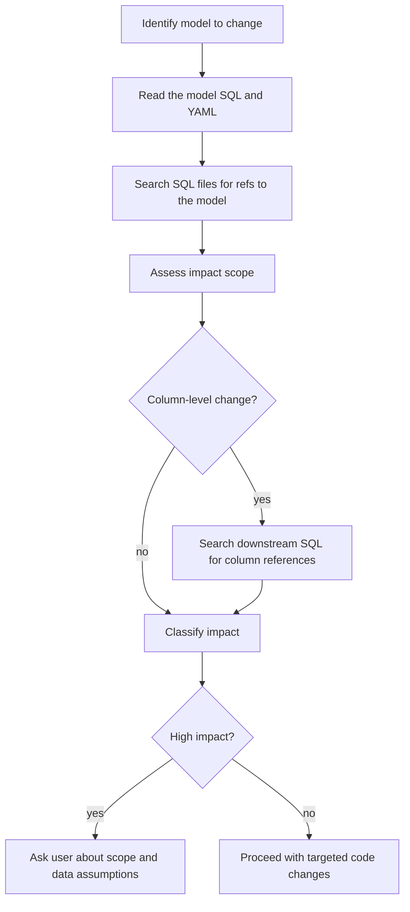

# Evaluating Impact of a dbt Model Change

Assess downstream dependencies before modifying a dbt model. Determine scope of impact by inspecting SQL/YAML files and repository structure, not by executing project tooling.

## When to Use

- Before changing SQL logic in an existing model
- Before renaming, removing, or changing column types
- Before changing model materialization

**Not for:** New models (no downstream dependencies yet)

## Workflow

## Getting Downstream Dependencies

Use repository inspection:

1. Identify the model name from the file name or YAML `models:` entry.
2. Search model SQL files for `ref('model_name')` and `ref("model_name")`.
3. Repeat recursively for each downstream model if broader impact matters.
4. Read downstream YAML files to understand documented column contracts and business meaning.

## Column-Level Impact

When changing or removing a column, identify which downstream models reference it:

- Search downstream SQL files for the column name.
- Check YAML column descriptions and tests that reference the column.
- Review unit tests and fixtures that include the column.
- If usage is ambiguous, ask the user whether the column is part of a public contract or safe to change.

## Impact Classification

| Level | Criteria | Action |
|-------|----------|--------|
| **Low** | 1-5 downstream models | Proceed after reading downstream SQL/YAML |
| **Medium** | 6-15 downstream models | Consider narrowing the change or asking the user to confirm priority paths |
| **High** | 16+ downstream models | Ask user whether to limit scope or split into smaller changes |

When impact is high, ask the user:

> "This change appears to affect N downstream models based on repository references. Do you want to update all downstream usages now, or limit this change to a specific set of models?"

## Quick Reference

| Task | Repository inspection approach |
|------|--------------------------------|
| List downstream | Search SQL files for `ref('model_name')` and recurse as needed |
| Count downstream | Count unique model files found during reference search |
| Find column refs | Search model SQL/YAML/test files for the column name |

## Common Mistakes

**Not checking before changing** - Always assess impact first, even for "small" changes.

**Ignoring column-level impact** - Removing a column breaks downstream models that reference it. Check column usage, not just model dependencies.

**Assuming runtime validation is available** - Validate by reading SQL/YAML and ask the user for data samples or clarification when behavior depends on data.
